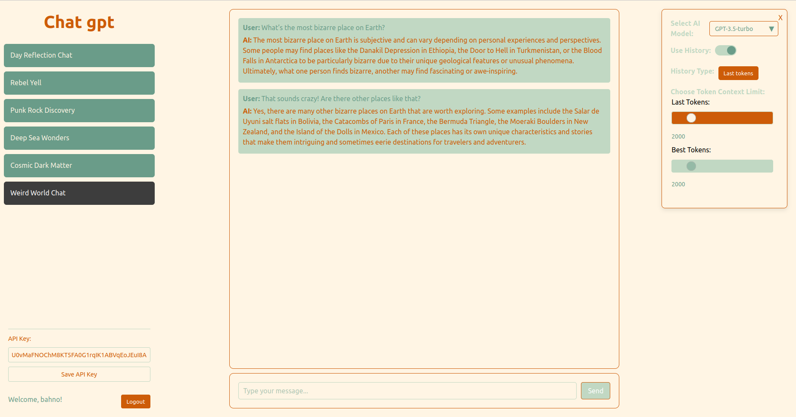

# GPT Chat Web App

A ChatGPT-style web app built with **React** and **Flask**, allowing you to choose your preferred GPT model and manage the context window for each conversation. It connects to OpenAI's GPT models using your own API key and streams responses back in real time — character by character, just like the real thing.

🛠️ Thrown together in the summer of 2024, because why not.



## 🔥 Features

- **ChatGPT-like Interface** – built with React.
- **Backend in FastAPI** – handles communication, authentication, and GPT logic.
- **GPT-3.5 / GPT-4 / GPT-4o-mini** – easily switch between models.
- **Guest Mode** – enter your own OpenAI API key to chat.
- **User Accounts** – register & store your key securely in a SQL database.
- **JWT Authentication** – secure token-based login system.
- **Chat History** – backend saves your chat threads.
- **Streamed Responses** – responses appear live, one letter at a time.
- **Context Management** – toggle history on/off per chat.
- **Custom Context Size** – choose how many tokens to include in context.
- **Context Modes**:
  - **Last N Tokens** – includes the most recent messages.
  - **Best N Tokens** – uses embeddings + cosine similarity to include the most relevant past messages.
- **Embeddings** – uses OpenAI’s embedding API for smart context selection.
- **Token Cost Calculation** – calculates and displays the cost of each message in USD.

## 🚀 Getting Started

### Backend Setup (FastAPI)

1. Navigate to the `backend/` folder:
    ```bash
    cd backend
    ```

2. Create a virtual environment & install dependencies:
    ```bash
    python -m venv venv
    source venv/bin/activate  # Windows: venv\Scripts\activate
    pip install -r requirements.txt
    ```
4. Run the server:
    ```bash
    python main.py
    ```

---

### Frontend Setup (React)

1. Navigate to the `frontend/` folder:
    ```bash
    cd frontend
    ```

2. Install dependencies:
    ```bash
    npm install
    ```

4. Start the development server:
    ```bash
    npm run dev
    ```

---

## 💾 Database

Uses SQLAlchemy + SQLite (or any DB you configure) to store:

- User accounts
- API keys (encrypted or secured)
- Chat threads
- Message history
- Embeddings (for context relevance)

---

## 🔐 Auth

- Simple login and registration system
- Auth handled with JWT tokens behind the scenes
- API keys can be stored securely if you're logged in
- Or just use it without logging in by pasting your API key


## 💸 Token Cost Calculation

Each GPT message calculates the **exact token usage** and converts it to **cost in USD**, based on OpenAI’s pricing for the selected model.

---


## 🤖 Context Modes Explained

### 1. **Last N Tokens Mode**
- Uses the most recent messages from the thread up to the token limit.
- Best for consistent back-and-forth chats.

### 2. **Best N Tokens Mode**
- Uses OpenAI’s embedding API to compute semantic similarity.
- Selects the most relevant past messages using cosine distance.
- Ideal for long chats or switching topics.

---


## 🛠️ TODO

-  Allow users to delete and rename old chat threads
-  Add a button to start a new chat thread (currently you have to F5)
-  Add special markup visualization for better readability
-  Improve visuals for generated code (e.g., syntax highlighting or styling)
